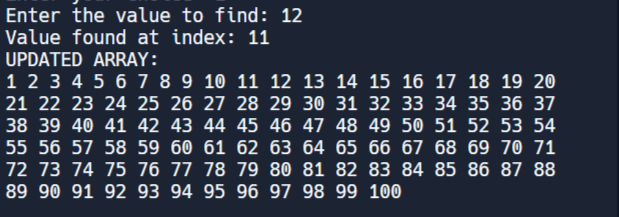
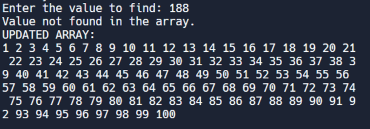
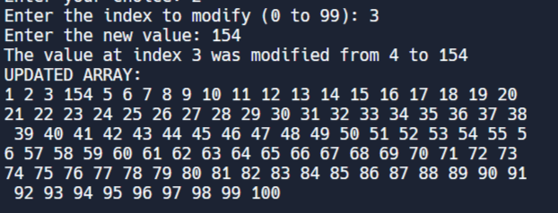
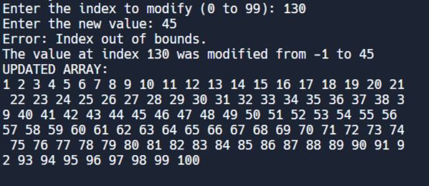
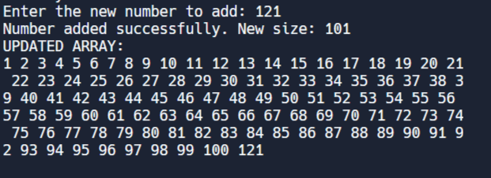
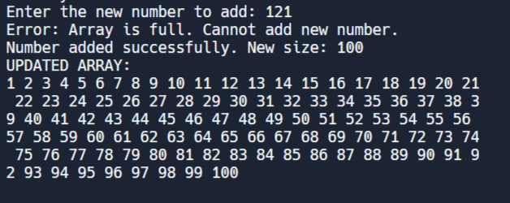
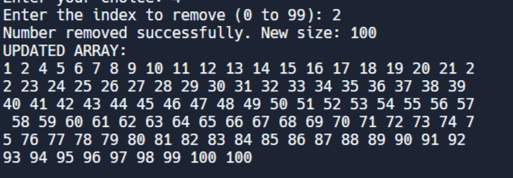

# README - Assignment 1: Array Operations Program 

The program will read the array from the file A1input.txt. You will then be prompted to:
- Find the number in an array. 
- Modify the value at a specified index.
- Add a new number to the array.
- Remove a number at a given index.

## Files
- main.cpp: Contains the main logic of the program and user interaction.
- Question1.h: Header file that contains the function declarations for basic array functions
- Question1.cpp: Code of basic array functions
- Question2.h : Header file containing functions with error handling
- Question2.cpp: Code of error handling array functions
- A1input.txt: Input file from which the array of numbers is loaded.

## Implementation:
### 1. Create array, size, and MAX_SIZE variables to initialize array:

'''cpp

    const int MAX_SIZE = 100;
    int array[MAX_SIZE]; // Array to store the numbers
    int size = 0; // Size of the array

'''

### 2. Open and Read Input File and Load to a one-dimensional vector

'''cpp

    ifstream inputFile("A1input.txt");

    if (!inputFile) {
	    cout << "Error Opening File." << endl;
    }

    string line;
    while (getline(inputFile, line)) {
        stringstream ss(line);
        int num;
        while (ss >> num && size < MAX_SIZE) {
            array[size] = num;
            size++;
        }
    }

    inputFile.close(); // Close the input file after reading
'''

Array Once File Loaded:
'''

    Array loaded from file:
    1 2 3 4 5 6 7 8 9 10 11 12 13 14 15 16 17 18 19 20 21 22 23 24 25 26 27 28 29 30 31 32 33 34 35 36 37 38 39 40 41 42 43 44 45 46 47 48 49 50 51 52 53 54 55 56 57 58 59 60 61 62 63 64 65 66 67 68 69 70 71 72 73 74 75 76 77 78 79 80 81 82 83 84 85 86 87 88 89 90 91 92 93 94 95 96 97 98 99 100 

'''

### 3. Set Up Operations Menu. Ask user to pick from array operations mentioned in Question1.h. Each option corresponds to a function in Question1.h.

'''

    Operations Menu:
        1. Find a number in the array
        2. Modify a number in the array
        3. Add a new number to the array
        4. Remove a number from the array
        5. Exit
'''

Sample Output From Operation 1:

Number Found:

Number Not Found:

Sample Output From Operation 2:

Sample Output From Operation 2 w/ Error Handling:

Sample Output From Operation 3:

Sample Output From Operation 3 w/ Error Handling:

Sample Output From Operation 4:

